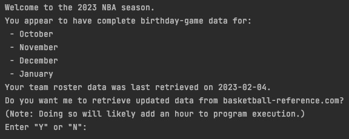
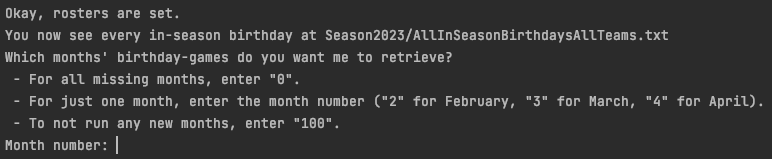
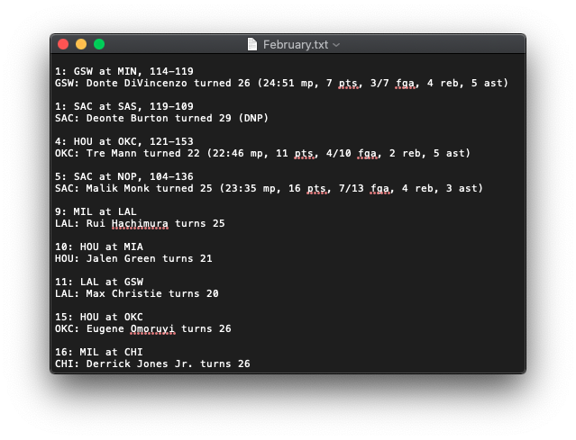
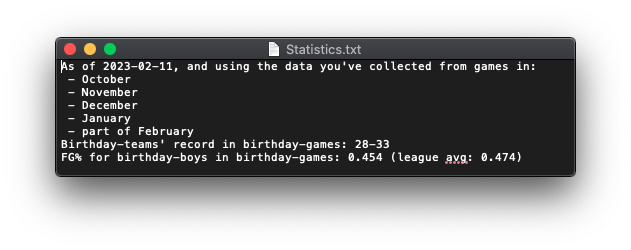

# NBA Birthdays

## Description

This Java program retrieves past and future NBA games played the day
after a participating player's birthday. One might consider betting
against a birthday-team you suspect will go a little too hard the 
night before.

## Usage

Run the following in the `main` method in `NbaBirthdaysDriver.java`:

```java
Nba nbaNow = new Nba(2023); // for the 2022-23 NBA season
// the default constructor NBA() sets it to the current season
nbaNow.run();
```

This prints to the console:
* the current NBA Season,
* the months of complete birthday-game data already saved, and
* the date on which team roster data was last updated.



The user can choose whether to scrape new roster data from 
[basketball-reference.com](https://www.basketball-reference.com/)
or continue using roster data from the last update. This is raw HTML 
code saved to text files (one per team). For example, running this in 
February will generate `ATL2.txt`, `BOS2.txt`, etc. The user will not be 
interested in viewing these files, but now team rosters are set.



Then the user can choose to retrieve additional birthday games. This 
might be because the user has never retrieved these games, or because
games have occurred since the date of last retrieval, and they want
to capture the results of the game and birthday boys' stats. This 
data is saved to text files (one per month), e.g., `October.txt`, 
`November.txt`, etc.

These are the files the user will be most interested in viewing. In 
the example below, this `February.txt` file was last modified by our 
program on February 7th, so only games prior to that date have results 
attached.



Finally, the user is asked whether they want to gather birthday-game 
stats. This calculates some statistics and saves them to 
`Statistics.txt`.



(Hey, look! There might be something to this!)

All output files are saved in a directory for the corresponding 
season (e.g., `Season2023`), which the program creates if need be.


## Roadmap

There are two ways I'm interested in furthering this project. 

First, I would like to be both smarter and more flexible about 
which birthday-games to include. For instance, even we knew Lou 
Williams would celebrate his 21st birthday the day before a game in 
Atlanta ([home of Magic City](https://www.sbnation.com/nba/2020/8/5/21355463/lou-williams-magic-city-wings-nba-bubble)), 
the partied-too-hard postulate may be misplaced if the Atlanta game 
is on the second night of a back-to-back. Conversely, if a team had a 
couple of off days in LA, we may be interested in players with 
birthdays two days before their LA game as well as day-before birthday 
boys.

Second, I'd like to add some filters to the stats we collect. 
Presumably, an under-25 birthday is more impactful on a game than 
a 32nd birthday. Presumably, we're more interested in birthday-games 
that occur in notorious markets (LA, New York, Miami, Phoenix, etc.) 
than those that happen in Milwaukee or Oklahoma City.

<!--
## Contributing

I welcome feedback and suggestions that would improve performance, 
organization, or documentation, as well as ideas that would improve 
this tool from a sports betting perspective. I am not a particularly 
experienced programmer.

I am aware that Java is not the optimal tool for this purpose, but 
one of my personal motivations for this project was to learn more 
Java. Therefore, I am respectfully uninterested in feedback along 
the lines of, "It's way easier to scrape data from 
basketball-reference with Python."
-->

## Acknowledgements

Credit for the idea goes to Bill Simmons, who, on 
[this episode](https://www.theringer.com/the-bill-simmons-podcast/2023/1/25/23570404/memphis-grizzlies-best-nba-futures-bets-2023-oscars-nominations)
of The Bill Simmons Podcast, brings up a losing streak for the
"Still-Young Grizzlies", who

>end up blowing the Lakers game, like a legitimate, terrible choke
>job in a nationally televised game--like a like an absolute
> gag--and then you lose two more games.

Chris Vernon explains that it's

> a team filled with under-25s that went on a West Coast road trip.
> That first quarter against LA, you could tell. Then they went to
> Phoenix and--you know, you get in at whatever you get in...
> two-something... It's Dillon Brooks' birthday! So you come out,
> they get flamed out by Phoenix...

Et cetera. Later, Bill has an epiphany.

>Listen, you made some great points, but I think the best point you
> made--I have dollar signs in my head, House--is, can we create
> some sort of computer program for NBA player birthdays that
> coincides with road trips? It's like on my calendar..., it just
> pops up, "Dillon Brooks' birthday coincides with an LA-Phoenix
> combination!"

All data is scraped from [basketball-reference.com](https://www.basketball-reference.com/).

Also, thank you to [YargleWithWings](https://github.com/yarglewithwings) 
for helping me troubleshoot some issues.

## Project Status

I sent Bill the output of my program the day his podcast dropped,
and I still anxiously await his validation.